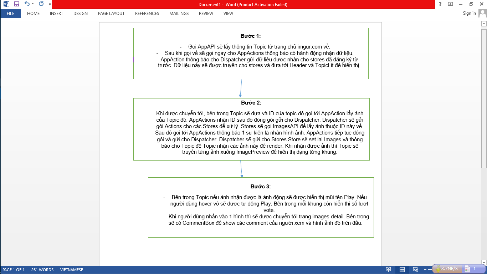
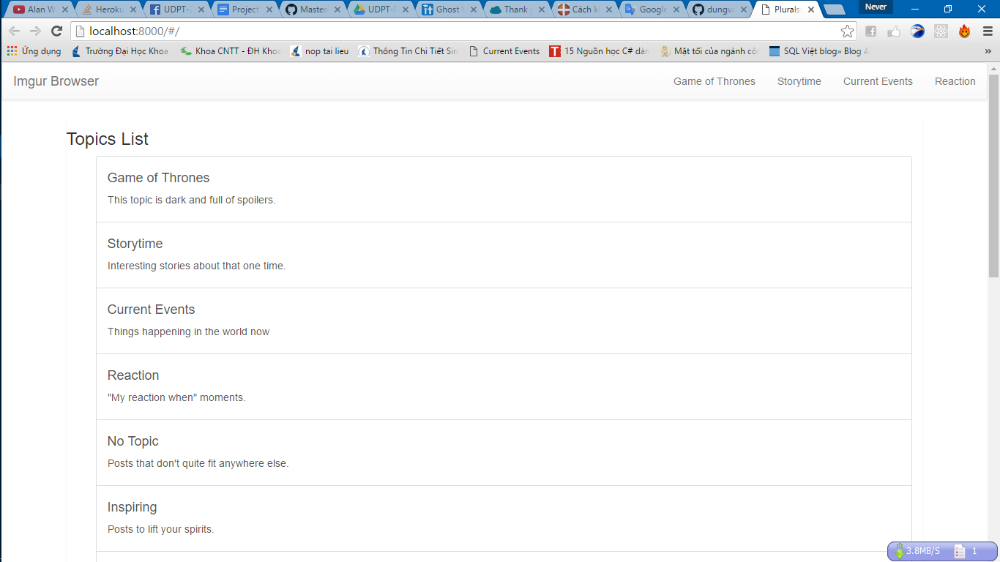
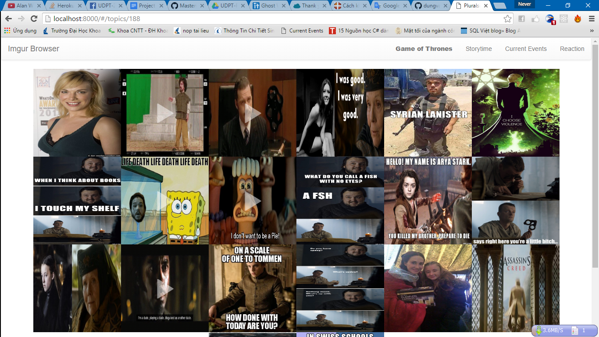
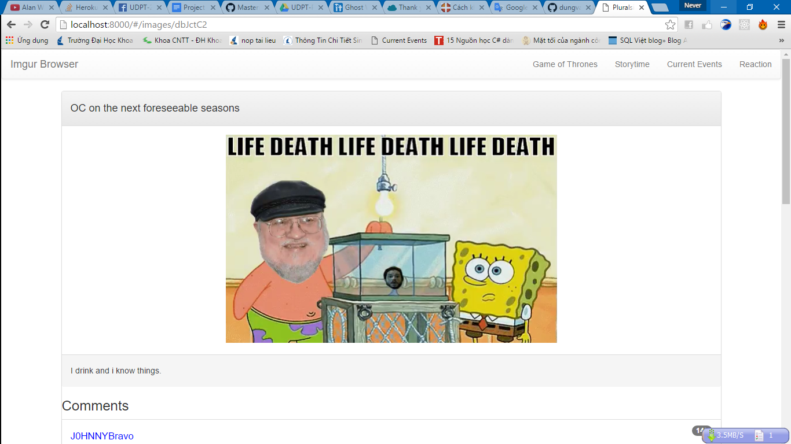
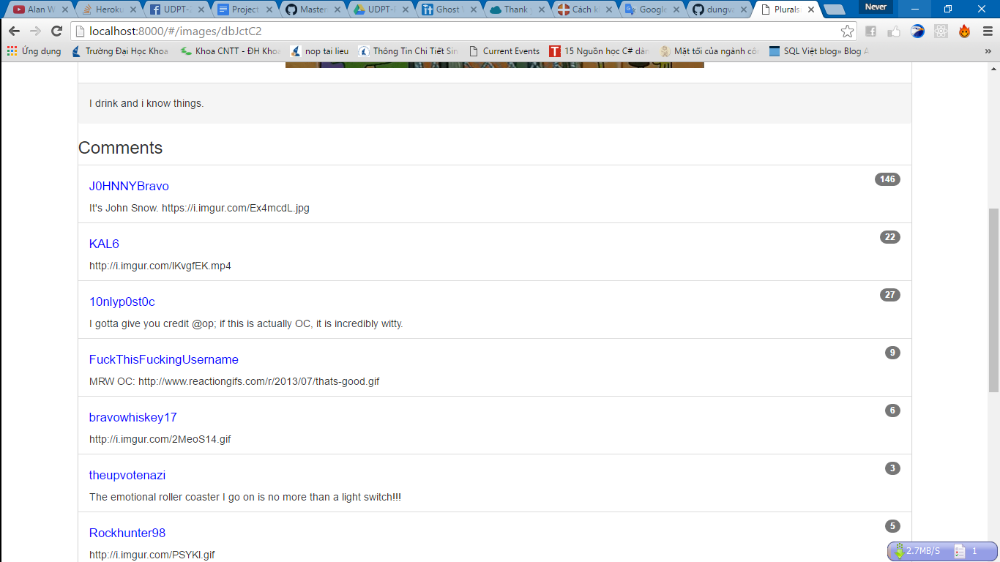

# Đồ án cuối kỳ - *NHÓM AVENGERS*

Danh sách sinh viên:

MSSV | Họ và tên
---- | ---------
1312070 | Nguyễn Phạm Hoàng Diễm
1312071 |
1312098 | Phùng Văn Dũng
1312123 | Nguyễn Ngô Thành Đạt

## Đề tài:
                 REACT - FLUX
## Wireframe

## Data Schema

Mô tả: Đây là trang chủ. Nơi hiển thị TopicList.

Mô tả: sau khi nhấn vào 1 Topic sẽ hiển ra các ảnh thuộc Topic này

Mô tả: Sau khi nhấn và 1 hình ảnh sẽ chuyển trang chi tiết của ảnh.

Mô tả:  show comment.

## Demo

# Các chức năng đã thực hiện
* [x] Git với Centralize Workflow
* [x] Git theo Feature Branch Workflow
* [x] Git theo Feature Branch Workflow có Pull Request
* [ ] Git theo Gitflow Workflow
